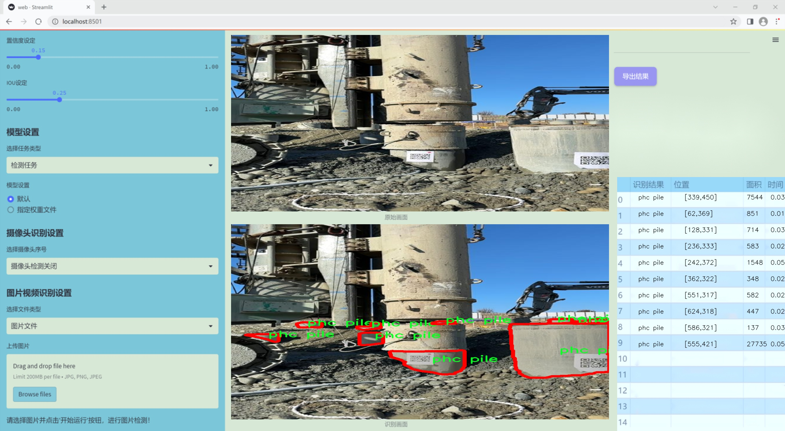
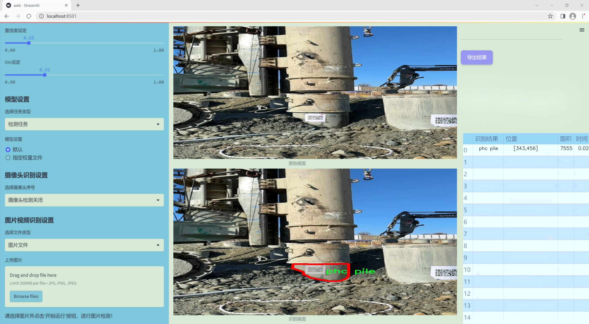
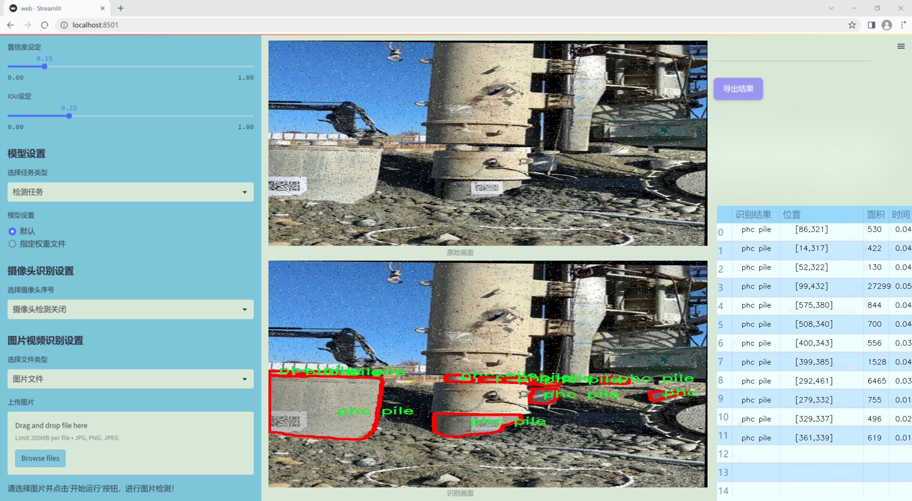
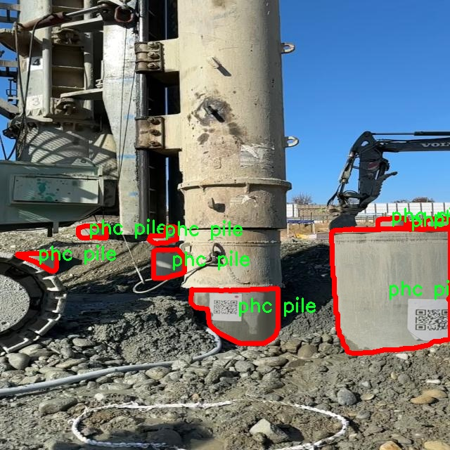
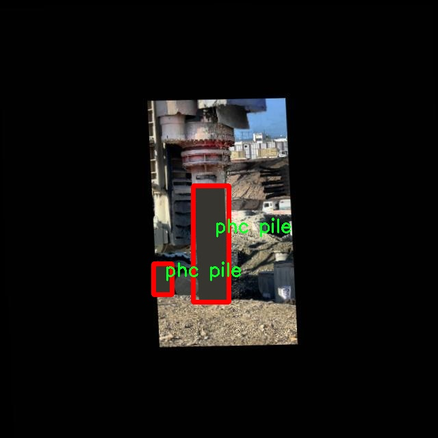
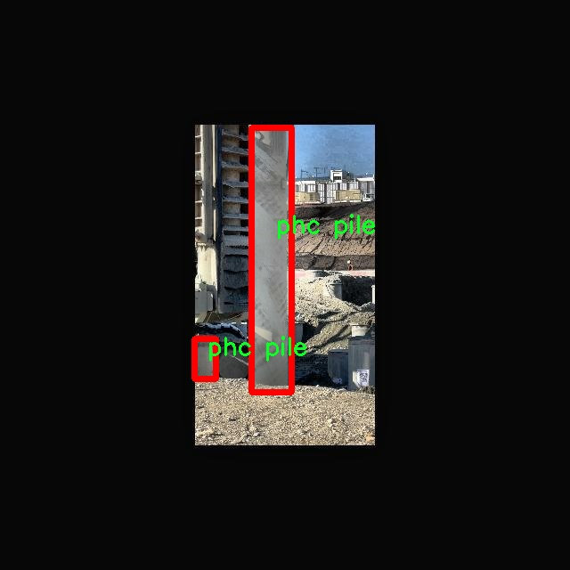
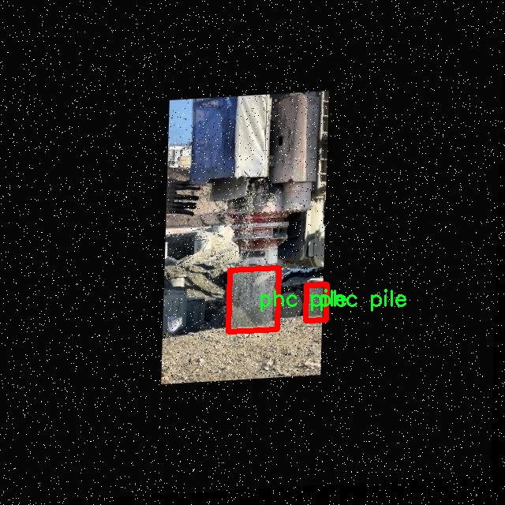
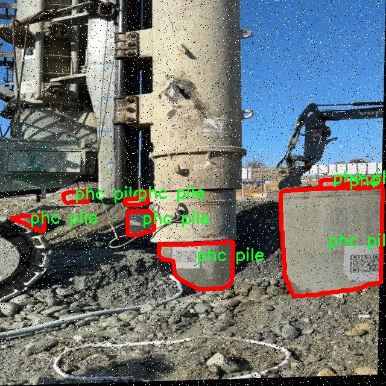

### 1.背景意义

研究背景与意义

在现代城市基础设施建设中，预制混凝土桩（PHC桩）作为一种重要的地基处理材料，广泛应用于各类建筑工程中。随着城市化进程的加快，对PHC桩的需求不断增加，如何高效、准确地进行PHC桩的实例分割与识别，成为了工程建设中亟待解决的问题。传统的人工检测方法不仅耗时耗力，而且容易受到人为因素的影响，导致检测结果的不准确性。因此，基于计算机视觉的自动化检测技术逐渐受到重视。

近年来，深度学习技术的快速发展为图像分割任务提供了新的解决方案。YOLO（You Only Look Once）系列模型因其高效的实时检测能力而广泛应用于实例分割领域。YOLOv11作为该系列的最新版本，结合了多种先进的技术，具备更强的特征提取能力和更高的检测精度。通过对YOLOv11模型的改进，能够更好地适应PHC桩的特征，提升实例分割的准确性和鲁棒性。

本研究旨在构建一个基于改进YOLOv11的PHC桩实例分割系统。该系统将利用包含5400张图像的专用数据集，进行PHC桩的自动识别与分割。数据集中仅包含一个类别——PHC桩，且经过精细的标注和多种数据增强处理，确保了模型训练的有效性与准确性。通过对该系统的研究与应用，不仅可以提高PHC桩的检测效率，还能为其他类似工程的自动化检测提供借鉴。

综上所述，基于改进YOLOv11的PHC桩实例分割系统的研究具有重要的理论意义和实际应用价值。它不仅推动了计算机视觉技术在土木工程领域的应用进程，也为未来的智能建筑与基础设施建设提供了新的思路与方法。

### 2.视频效果

[2.1 视频效果](https://www.bilibili.com/video/BV1FpqGYTEZV/)

### 3.图片效果







##### [项目涉及的源码数据来源链接](https://kdocs.cn/l/cszuIiCKVNis)**

注意：本项目提供训练的数据集和训练教程,由于版本持续更新,暂不提供权重文件（best.pt）,请按照6.训练教程进行训练后实现上图演示的效果。

### 4.数据集信息

##### 4.1 本项目数据集类别数＆类别名

nc: 1
names: ['phc pile']


该项目为【图像分割】数据集，请在【训练教程和Web端加载模型教程（第三步）】这一步的时候按照【图像分割】部分的教程来训练

##### 4.2 本项目数据集信息介绍

本项目数据集信息介绍

本项目所使用的数据集专注于PHC桩的实例分割，旨在为改进YOLOv11的PHC桩实例分割系统提供高质量的训练数据。该数据集的主题为“civil-segm”，其主要目标是通过精确的实例分割技术，提升对PHC桩在土木工程领域中的识别和分析能力。数据集中包含的类别数量为1，具体类别为“phc pile”，这意味着所有的标注数据均围绕这一特定类别展开，确保了数据集的专一性和针对性。

在数据收集过程中，我们通过多种途径获取了丰富的PHC桩图像，包括实地拍摄和公开数据库的整合。这些图像涵盖了不同环境、不同角度和不同光照条件下的PHC桩，力求反映出真实世界中PHC桩的多样性。每张图像都经过精细的标注，确保每个PHC桩实例都被准确识别和分割，为模型的训练提供了坚实的基础。

此外，为了增强数据集的多样性和模型的泛化能力，我们还进行了数据增强处理，包括旋转、缩放、翻转等操作。这些处理不仅增加了数据集的样本数量，还提高了模型在不同情况下的鲁棒性。通过这样的数据集构建，我们期望在PHC桩的实例分割任务中实现更高的准确率和更好的性能表现，从而为土木工程领域的相关应用提供更为强大的技术支持。总之，本项目的数据集为改进YOLOv11的PHC桩实例分割系统奠定了坚实的基础，期待其在实际应用中的表现。











### 5.全套项目环境部署视频教程（零基础手把手教学）

[5.1 所需软件PyCharm和Anaconda安装教程（第一步）](https://www.bilibili.com/video/BV1BoC1YCEKi/?spm_id_from=333.999.0.0&vd_source=bc9aec86d164b67a7004b996143742dc)


[5.2 安装Python虚拟环境创建和依赖库安装视频教程（第二步）](https://www.bilibili.com/video/BV1ZoC1YCEBw?spm_id_from=333.788.videopod.sections&vd_source=bc9aec86d164b67a7004b996143742dc)

### 6.改进YOLOv11训练教程和Web_UI前端加载模型教程（零基础手把手教学）

[6.1 改进YOLOv11训练教程和Web_UI前端加载模型教程（第三步）](https://www.bilibili.com/video/BV1BoC1YCEhR?spm_id_from=333.788.videopod.sections&vd_source=bc9aec86d164b67a7004b996143742dc)


按照上面的训练视频教程链接加载项目提供的数据集，运行train.py即可开始训练



     Epoch   gpu_mem       box       obj       cls    labels  img_size
     1/200     20.8G   0.01576   0.01955  0.007536        22      1280: 100%|██████████| 849/849 [14:42<00:00,  1.04s/it]
               Class     Images     Labels          P          R     mAP@.5 mAP@.5:.95: 100%|██████████| 213/213 [01:14<00:00,  2.87it/s]
                 all       3395      17314      0.994      0.957      0.0957      0.0843

     Epoch   gpu_mem       box       obj       cls    labels  img_size
     2/200     20.8G   0.01578   0.01923  0.007006        22      1280: 100%|██████████| 849/849 [14:44<00:00,  1.04s/it]
               Class     Images     Labels          P          R     mAP@.5 mAP@.5:.95: 100%|██████████| 213/213 [01:12<00:00,  2.95it/s]
                 all       3395      17314      0.996      0.956      0.0957      0.0845

     Epoch   gpu_mem       box       obj       cls    labels  img_size
     3/200     20.8G   0.01561    0.0191  0.006895        27      1280: 100%|██████████| 849/849 [10:56<00:00,  1.29it/s]
               Class     Images     Labels          P          R     mAP@.5 mAP@.5:.95: 100%|███████   | 187/213 [00:52<00:00,  4.04it/s]
                 all       3395      17314      0.996      0.957      0.0957      0.0845


###### [项目数据集下载链接](https://kdocs.cn/l/cszuIiCKVNis)

### 7.原始YOLOv11算法讲解

YOLOv11是Ultralytics推出的YOLO系列最新版本，专为实现尖端的物体检测而设计。其架构和训练方法上进行了重大改进，使之不仅具备卓越的准确性和处理速度，还在计算效率上实现了一场革命。得益于其改进的主干和颈部架构，YOLOv11在特征提取和处理复杂任务时表现更加出色。在2024年9月27日，Ultralytics通过长达九小时的在线直播发布这一新作，展示了其在计算机视觉领域的革新。

YOLOv11通过精细的架构设计和优化训练流程，在保持高精度的同时，缩减了参数量，与YOLOv8m相比减少了22%的参数，使其在COCO数据集上的平均准确度（mAP）有所提升。这种效率的提高使YOLOv11非常适合部署在各种硬件环境中，包括边缘设备、云计算平台以及支持NVIDIA GPU的系统，确保在灵活性上的优势。

该模型支持广泛的任务，从对象检测、实例分割到图像分类、姿态估计和定向对象检测（OBB），几乎覆盖了计算机视觉的所有主要挑战。其创新的C3k2和C2PSA模块提升了网络深度和注意力机制的应用，提高了特征提取的效率和效果。同时，YOLOv11的改进网络结构也使之在复杂视觉任务上得以从容应对，成为各类计算机视觉任务的多功能选择。这些特性令YOLOv11在实施实时物体检测的各个领域中表现出众。
* * *

2024年9月27日，Ultralytics在线直播长达九小时，为YOLO11召开“发布会”

YOLO11 是 Ultralytics YOLO 系列实时物体检测器的最新版本，它以尖端的准确性、速度和效率重新定义了可能性。在之前 YOLO
版本的显著进步的基础上，YOLO11 在架构和训练方法方面进行了重大改进，使其成为各种计算机视觉任务的多功能选择。


##### YOLO11主要特点：

  * 增强的特征提取：YOLO11 采用了改进的主干和颈部架构，增强了特征提取能力，可实现更精确的对象检测和复杂任务性能。
  * 针对效率和速度进行了优化：YOLO11 引入了完善的架构设计和优化的训练流程，可提供更快的处理速度，并在准确度和性能之间保持最佳平衡。
  * 更少的参数，更高的准确度：借助模型设计的进步，YOLO11m 在 COCO 数据集上实现了更高的平均准确度 (mAP)，同时使用的参数比 YOLOv8m 少 22%，从而提高了计算效率，同时又不影响准确度。
  * 跨环境的适应性：YOLO11 可以无缝部署在各种环境中，包括边缘设备、云平台和支持 NVIDIA GPU 的系统，从而确保最大的灵活性。
  * 支持的任务范围广泛：无论是对象检测、实例分割、图像分类、姿势估计还是定向对象检测 (OBB)，YOLO11 都旨在满足各种计算机视觉挑战。

##### 支持的任务和模式

YOLO11 以 YOLOv8 中引入的多功能模型系列为基础，为各种计算机视觉任务提供增强的支持：

Model| Filenames| Task| Inference| Validation| Training| Export  
---|---|---|---|---|---|---  
YOLO11| yolol11n.pt, yolol11s.pt, yolol11m.pt, yolol11x.pt| Detection| ✅| ✅|
✅| ✅  
YOLO11-seg| yolol11n-seg.pt, yolol11s-seg.pt, yolol11m-seg.pt,
yolol11x-seg.pt| Instance Segmentation| ✅| ✅| ✅| ✅  
YOLO11-pose| yolol11n-pose.pt, yolol11s-pose.pt, yolol11m-pose.pt,
yolol11x-pose.pt| Pose/Keypoints| ✅| ✅| ✅| ✅  
YOLO11-obb| yolol11n-obb.pt, yolol11s-obb.pt, yolol11m-obb.pt,
yolol11x-obb.pt| Oriented Detection| ✅| ✅| ✅| ✅  
YOLO11-cls| yolol11n-cls.pt, yolol11s-cls.pt, yolol11m-cls.pt,
yolol11x-cls.pt| Classification| ✅| ✅| ✅| ✅  
  
##### 简单的 YOLO11 训练和推理示例

以下示例适用于用于对象检测的 YOLO11 Detect 模型。

    
    
    from ultralytics import YOLO
    
    # Load a model
    model = YOLO("yolo11n.pt")
    
    # Train the model
    train_results = model.train(
        data="coco8.yaml",  # path to dataset YAML
        epochs=100,  # number of training epochs
        imgsz=640,  # training image size
        device="cpu",  # device to run on, i.e. device=0 or device=0,1,2,3 or device=cpu
    )
    
    # Evaluate model performance on the validation set
    metrics = model.val()
    
    # Perform object detection on an image
    results = model("path/to/image.jpg")
    results[0].show()
    
    # Export the model to ONNX format
    path = model.export(format="onnx")  # return path to exported model

##### 支持部署于边缘设备

YOLO11 专为适应各种环境而设计，包括边缘设备。其优化的架构和高效的处理能力使其适合部署在边缘设备、云平台和支持 NVIDIA GPU
的系统上。这种灵活性确保 YOLO11 可用于各种应用，从移动设备上的实时检测到云环境中的复杂分割任务。有关部署选项的更多详细信息，请参阅导出文档。

##### YOLOv11 yaml文件

    
    
    # Ultralytics YOLO 🚀, AGPL-3.0 license
    # YOLO11 object detection model with P3-P5 outputs. For Usage examples see https://docs.ultralytics.com/tasks/detect
    
    # Parameters
    nc: 80 # number of classes
    scales: # model compound scaling constants, i.e. 'model=yolo11n.yaml' will call yolo11.yaml with scale 'n'
      # [depth, width, max_channels]
      n: [0.50, 0.25, 1024] # summary: 319 layers, 2624080 parameters, 2624064 gradients, 6.6 GFLOPs
      s: [0.50, 0.50, 1024] # summary: 319 layers, 9458752 parameters, 9458736 gradients, 21.7 GFLOPs
      m: [0.50, 1.00, 512] # summary: 409 layers, 20114688 parameters, 20114672 gradients, 68.5 GFLOPs
      l: [1.00, 1.00, 512] # summary: 631 layers, 25372160 parameters, 25372144 gradients, 87.6 GFLOPs
      x: [1.00, 1.50, 512] # summary: 631 layers, 56966176 parameters, 56966160 gradients, 196.0 GFLOPs
    
    # YOLO11n backbone
    backbone:
      # [from, repeats, module, args]
      - [-1, 1, Conv, [64, 3, 2]] # 0-P1/2
      - [-1, 1, Conv, [128, 3, 2]] # 1-P2/4
      - [-1, 2, C3k2, [256, False, 0.25]]
      - [-1, 1, Conv, [256, 3, 2]] # 3-P3/8
      - [-1, 2, C3k2, [512, False, 0.25]]
      - [-1, 1, Conv, [512, 3, 2]] # 5-P4/16
      - [-1, 2, C3k2, [512, True]]
      - [-1, 1, Conv, [1024, 3, 2]] # 7-P5/32
      - [-1, 2, C3k2, [1024, True]]
      - [-1, 1, SPPF, [1024, 5]] # 9
      - [-1, 2, C2PSA, [1024]] # 10
    
    # YOLO11n head
    head:
      - [-1, 1, nn.Upsample, [None, 2, "nearest"]]
      - [[-1, 6], 1, Concat, [1]] # cat backbone P4
      - [-1, 2, C3k2, [512, False]] # 13
    
      - [-1, 1, nn.Upsample, [None, 2, "nearest"]]
      - [[-1, 4], 1, Concat, [1]] # cat backbone P3
      - [-1, 2, C3k2, [256, False]] # 16 (P3/8-small)
    
      - [-1, 1, Conv, [256, 3, 2]]
      - [[-1, 13], 1, Concat, [1]] # cat head P4
      - [-1, 2, C3k2, [512, False]] # 19 (P4/16-medium)
    
      - [-1, 1, Conv, [512, 3, 2]]
      - [[-1, 10], 1, Concat, [1]] # cat head P5
      - [-1, 2, C3k2, [1024, True]] # 22 (P5/32-large)
    
      - [[16, 19, 22], 1, Detect, [nc]] # Detect(P3, P4, P5)
    

**YOLO11和YOLOv8 yaml文件的区别**


##### 改进模块代码

  * C3k2 

    
    
    class C3k2(C2f):
        """Faster Implementation of CSP Bottleneck with 2 convolutions."""
    
        def __init__(self, c1, c2, n=1, c3k=False, e=0.5, g=1, shortcut=True):
            """Initializes the C3k2 module, a faster CSP Bottleneck with 2 convolutions and optional C3k blocks."""
            super().__init__(c1, c2, n, shortcut, g, e)
            self.m = nn.ModuleList(
                C3k(self.c, self.c, 2, shortcut, g) if c3k else Bottleneck(self.c, self.c, shortcut, g) for _ in range(n)
            )

C3k2，它是具有两个卷积的CSP（Partial Cross Stage）瓶颈架构的更快实现。

**类继承：**

  * `C3k2`继承自类`C2f`。这表明`C2f`很可能实现了经过修改的基本CSP结构，而`C3k2`进一步优化或修改了此结构。

**构造函数（`__init__`）：**

  * `c1`：输入通道。

  * `c2`：输出通道。

  * `n`：瓶颈层数（默认为1）。

  * `c3k`：一个布尔标志，确定是否使用`C3k`块或常规`Bottleneck`块。

  * `e`：扩展比率，控制隐藏层的宽度（默认为0.5）。

  * `g`：分组卷积的组归一化参数或组数（默认值为 1）。

  * `shortcut`：一个布尔值，用于确定是否在网络中包含快捷方式连接（默认值为 `True`）。

**初始化：**

  * `super().__init__(c1, c2, n, short-cut, g, e)` 调用父类 `C2f` 的构造函数，初始化标准 CSP 组件，如通道数、快捷方式、组等。

**模块列表（`self.m`）：**

  * `nn.ModuleList` 存储 `C3k` 或 `Bottleneck` 模块，具体取决于 `c3k` 的值。

  * 如果 `c3k` 为 `True`，它会初始化 `C3k` 模块。`C3k` 模块接收以下参数：

  * `self.c`：通道数（源自 `C2f`）。

  * `2`：这表示在 `C3k` 块内使用了两个卷积层。

  * `shortcut` 和 `g`：从 `C3k2` 构造函数传递。

  * 如果 `c3k` 为 `False`，则初始化标准 `Bottleneck` 模块。

`for _ in range(n)` 表示将创建 `n` 个这样的块。

**总结：**

  * `C3k2` 实现了 CSP 瓶颈架构，可以选择使用自定义 `C3k` 块（具有两个卷积）或标准 `Bottleneck` 块，具体取决于 `c3k` 标志。

  * C2PSA

    
    
    class C2PSA(nn.Module):
        """
        C2PSA module with attention mechanism for enhanced feature extraction and processing.
    
        This module implements a convolutional block with attention mechanisms to enhance feature extraction and processing
        capabilities. It includes a series of PSABlock modules for self-attention and feed-forward operations.
    
        Attributes:
            c (int): Number of hidden channels.
            cv1 (Conv): 1x1 convolution layer to reduce the number of input channels to 2*c.
            cv2 (Conv): 1x1 convolution layer to reduce the number of output channels to c.
            m (nn.Sequential): Sequential container of PSABlock modules for attention and feed-forward operations.
    
        Methods:
            forward: Performs a forward pass through the C2PSA module, applying attention and feed-forward operations.
    
        Notes:
            This module essentially is the same as PSA module, but refactored to allow stacking more PSABlock modules.
    
        Examples:
            >>> c2psa = C2PSA(c1=256, c2=256, n=3, e=0.5)
            >>> input_tensor = torch.randn(1, 256, 64, 64)
            >>> output_tensor = c2psa(input_tensor)
        """
    
        def __init__(self, c1, c2, n=1, e=0.5):
            """Initializes the C2PSA module with specified input/output channels, number of layers, and expansion ratio."""
            super().__init__()
            assert c1 == c2
            self.c = int(c1 * e)
            self.cv1 = Conv(c1, 2 * self.c, 1, 1)
            self.cv2 = Conv(2 * self.c, c1, 1)
    
            self.m = nn.Sequential(*(PSABlock(self.c, attn_ratio=0.5, num_heads=self.c // 64) for _ in range(n)))
    
        def forward(self, x):
            """Processes the input tensor 'x' through a series of PSA blocks and returns the transformed tensor."""
            a, b = self.cv1(x).split((self.c, self.c), dim=1)
            b = self.m(b)
            return self.cv2(torch.cat((a, b), 1))

`C2PSA` 模块是一个自定义神经网络层，带有注意力机制，用于增强特征提取和处理。

**类概述**

  * **目的：**

  * `C2PSA` 模块引入了一个卷积块，利用注意力机制来改进特征提取和处理。

  * 它使用一系列 `PSABlock` 模块，这些模块可能代表某种形式的位置自注意力 (PSA)，并且该架构旨在允许堆叠多个 `PSABlock` 层。

**构造函数（`__init__`）：**

  * **参数：**

  * `c1`：输入通道（必须等于 `c2`）。

  * `c2`：输出通道（必须等于 `c1`）。

  * `n`：要堆叠的 `PSABlock` 模块数量（默认值为 1）。

  * `e`：扩展比率，用于计算隐藏通道的数量（默认值为 0.5）。

  * **属性：**

  * `self.c`：隐藏通道数，计算为 `int(c1 * e)`。

  * `self.cv1`：一个 `1x1` 卷积，将输入通道数从 `c1` 减少到 `2 * self.c`。这为将输入分成两部分做好准备。

  * `self.cv2`：另一个 `1x1` 卷积，处理后将通道维度恢复回 `c1`。

  * `self.m`：一系列 `PSABlock` 模块。每个 `PSABlock` 接收 `self.c` 通道，注意头的数量为 `self.c // 64`。每个块应用注意和前馈操作。

**前向方法：**

  * **输入：**

  * `x`，输入张量。

  * **操作：**

  1. `self.cv1(x)` 应用 `1x1` 卷积，将输入通道大小从 `c1` 减小到 `2 * self.c`。

  2. 生成的张量沿通道维度分为两部分，`a` 和 `b`。

  * `a`：第一个 `self.c` 通道。

  * `b`：剩余的 `self.c` 通道。

  1. `b` 通过顺序容器 `self.m`，它是 `PSABlock` 模块的堆栈。这部分经过基于注意的处理。

  2. 处理后的张量 `b` 与 `a` 连接。

  3. `self.cv2` 应用 `1x1` 卷积，将通道大小恢复为 `c1`。

  * **输出：**

  * 应用注意和卷积操作后的变换后的张量。

**总结：**

  * **C2PSA** 是一个增强型卷积模块，它通过堆叠的 `PSABlock` 模块应用位置自注意力。它拆分输入张量，将注意力应用于其中一部分，然后重新组合并通过最终卷积对其进行处理。此结构有助于从输入数据中提取复杂特征。

##### 网络结构


### 8.200+种全套改进YOLOV11创新点原理讲解

#### 8.1 200+种全套改进YOLOV11创新点原理讲解大全

由于篇幅限制，每个创新点的具体原理讲解就不全部展开，具体见下列网址中的改进模块对应项目的技术原理博客网址【Blog】（创新点均为模块化搭建，原理适配YOLOv5~YOLOv11等各种版本）

[改进模块技术原理博客【Blog】网址链接](https://gitee.com/qunmasj/good)


#### 8.2 精选部分改进YOLOV11创新点原理讲解

###### 这里节选部分改进创新点展开原理讲解(完整的改进原理见上图和[改进模块技术原理博客链接](https://gitee.com/qunmasj/good)【如果此小节的图加载失败可以通过CSDN或者Github搜索该博客的标题访问原始博客，原始博客图片显示正常】



### Diverse Branch Block简介
参考该博客提出的一种通用的卷积网络构造块用来在不增加任何推理时间的前提下提升卷积网络的性能。我们将这个块命名为分离分支块（Diverse Branch Block）。通过结合不同尺寸和复杂度的分离分支（包括串联卷积、多尺度卷积和平均池化层）来增加特征空间的方法，它提升了单个卷积的表达能力。完成训练后，一个DBB(Diverse Branch Block)可以被等价地转换为一个单独的卷积操作以方便部署。不同于那些新颖的卷积结构的改进方式，DBB让训练时微结构复杂化同时维持大规模结构，因此我们可以将它作为任意结构中通用卷积层的一种嵌入式替代形式。通过这种方式，我们能够将模型训练到一个更高的表现水平，然后在推理时转换成原始推理时间的结构。

 
主要贡献点：

（1） 我们建议合并大量的微结构到不同的卷积结构中来提升性能，但是维持原始的宏观结构。

（2）我们提出DBB，一个通用构造块结构，概括六种转换来将一个DBB结构转化成一个单独卷积，因为对于用户来说它是无损的。

（3）我们提出一个Inception-like DBB结构实例(Fig 1)，并且展示它在ImageNet、COCO detection 和CityScapes任务中获得性能提升。


#### 结构重参数化
本文和一个并发网络RepVGG[1]是第一个使用结构重参数化来命名该思路------使用从其他结构转化来的参数确定当前结构的参数。一个之前的工作ACNet[2]也可以被划分为结构重参数化，它提出使用非对称卷积块来增强卷积核的结构（i.e 十字形结构）。相比于DBB，它被设计来提升卷积网络（在没有额外推理时间损失的条件下）。这个流水线也包含将一个训练好的模型转化为另一个。但是，ACNet和DBB的区别是：ACNet的思想被激发是基于一个观察，这个观察是网络结构的参数在过去有更大的量级，因此寻找方法让参数量级更大，然而我们关注一个不同的点。我们发现 平均池化、1x1 conv 和 1x1-kxk串联卷积是更有效的，因为它们提供了不同复杂度的路线，以及允许使用更多训练时非线性化。除此以外，ACB结构可以看作是DBB结构的一种特殊形式，因为那个1xk和kx1卷积层能够被扩大成kxk（via Transform VI(Fig.2)），然后合并成一个平方核（via Transform II）。

 

#### 分离分支结构
卷积的线性性
一个卷积操作可以表示为 ，其中为输入tensor, 为输出tensor。卷积核表示为一个四阶tensor , 偏置为。将加偏置的操作表示为。

因为，在第j个输出通道（h,w）位置的值可以由以下公式给出：，其中表示输入帧I的第c个通道上的一个滑动窗，对应输出帧O的坐标（h,w）。从上式可以看出，卷积操作具有齐次性和加法性。


注意：加法性成立的条件是两个卷积具有相同的配置（即通道数、核尺寸、步长和padding等）。

#### 分离分支的卷积
在这一小节，我们概括六种转换形式（Fig.2）来转换一个具有batch normalization(BN)、branch addition、depth concatenation、multi-scale operations、avarage pooling 和 sequences of convolutions的DBB分支。


Transform I：a conv for conv-BN  我们通常会给一个卷积配备配备一个BN层，它执行逐通道正则化和线性尺度放缩。设j为通道索引，分别为累积的逐通道均值和标准差，分别为学习的尺度因子和偏置项，对应输出通道j为


卷积的齐次性允许我们融合BN操作到前述的conv来做推理。在实践中，我们仅仅建立一个拥有卷积核和偏置, 用从原始BN序列的参数转换来的值来赋值。我们为每个输出通道j构造


Transform II a conv for branch addition  卷积的加法性确保如果有两个或者多个具有相同配置的卷积层相加，我们能够将它们合并到一个单独的卷积里面。对于conv-BN，我们应该首先执行Transform I。很明显的，通过下面的公式我们能够合并两个卷积


上述公式只有在两个卷积拥有相同配置时才成立。尽管合并上述分支能够在一定程度上增强模型，我们希望结合不同分支来进一步提升模型性能。在后面，我们介绍一些分支的形式，它们能够等价地被转化为一个单独的卷积。在通过多个转化来为每一个分支构造KxK的卷积之后，我们使用Transform II 将所有分支合并到一个conv里面。

Transform III: a conv for sequential convolutions   我们能够合并一个1x1 conv-BN-kxk conv序列到一个kxk conv里面。我们暂时假设卷积是稠密的（即 组数 groups=1）。组数groups>1的情形将会在Transform IV中实现。我们假定1x1和kxk卷积层的核形状分别是DxCx1x1和ExDxKxK，这里D指任意值。首先，我们将两个BN层融合到两个卷积层里面，由此获得。输出是


我们期望用一个单独卷积的核和偏置来表达，设, 它们满足。对方程（8）应用卷积的加法性，我们有


因为是一个1x1 conv，它只执行逐通道线性组合，没有空间聚合操作。通过线性重组KxK卷积核中的参数，我们能够将它合并到一个KxK的卷积核里面。容易证明的是，这样的转换可以由一个转置卷积实现：


其中是由转置获得的tensor张量。方程（10）的第二项是作用于常量矩阵上的卷积操作，因此它的输出也是一个常量矩阵。用表达式来说明，设是一个常数矩阵，其中的每个元素都等于p。*是一个2D 卷积操作，W为一个2D 卷积核。转换结果就是一个常量矩阵，这个常量矩阵是p 与 所有核元素之和 的乘积，即


基于以上观察，我们构造。然后，容易证明。

因此我们有

显而易见地，对于一个zero-pads 的KxK卷积，方程（8）并不成立，因为并不对的结果做卷积操作(如果有一个零元素的额外的圈，方程（8）成立)。解决方案有A)用padding配置第一个卷积，第二个卷积不用，B)通过做pad操作。后者的一个有效实现是定制第一个BN层，为了（1）如通常的batch-normalize输入。（2）计算(通过方程（6）)。（3）用  pad batch-normalized结果，例如 用一圈 pad 每一个通道j 。

Transform IV: a conv for depth concatenation  Inception 单元使用深度concatenation来组合不同分支。当每个分支都只包含一个相同配置的卷积时，深度concatenation等价于一个卷积，它的核在不同的输出通道上concatenation（比如我们公式中的第一个轴）假设。我们concatenate它们到。显然地


Transform IV 可以非常方便地将Transform III 扩展到 groupwise（即 groups > 1） 的情景。直觉上，一个groupwise 卷积将输入分割成g个并行的组，单独卷积它们，然后concatenate形成输出。为了代替g-group卷积，我们建立一个DBB结构，这个结构的所有卷积层有相同的组g。为了转换一个1x1-KxK序列，我们等价地分割它们成为g组，单独执行Transform III, 然后concatenate获得输出（如图Fig3所示）。


Transform V: a conv for average pooling  一个作用于C通道的核尺寸为K，步长为s的平均池化层等价于一个拥有相同核尺寸K,步长s的卷积层。这样的核可以被构造为

  


就像一个通常的平均池化操作，当s>1时执行降采样操作，当s=1时保持相同尺寸。

Transform VI: a conv for multi-scale convolutions   考虑一个等价于一个拥有相同zero padding的 核。特别地，卷积是格外实用的，因为它们能够有效实现。应该对输入作pad操作来对齐滑动窗。


### 9.系统功能展示

图9.1.系统支持检测结果表格显示

  图9.2.系统支持置信度和IOU阈值手动调节

  图9.3.系统支持自定义加载权重文件best.pt(需要你通过步骤5中训练获得)

  图9.4.系统支持摄像头实时识别

  图9.5.系统支持图片识别

  图9.6.系统支持视频识别

  图9.7.系统支持识别结果文件自动保存

  图9.8.系统支持Excel导出检测结果数据


### 10. YOLOv11核心改进源码讲解

#### 10.1 shiftwise_conv.py

以下是对给定代码的核心部分进行分析和详细注释的结果：

```python
import math
import torch
import torch.nn as nn
import torch.nn.functional as F

__all__ = ['ReparamLargeKernelConv']

def get_conv2d(in_channels, out_channels, kernel_size, stride, padding, dilation, groups, bias):
    """
    创建一个2D卷积层。
    
    参数:
    - in_channels: 输入通道数
    - out_channels: 输出通道数
    - kernel_size: 卷积核大小
    - stride: 步幅
    - padding: 填充
    - dilation: 膨胀
    - groups: 分组卷积
    - bias: 是否使用偏置
    """
    return nn.Conv2d(
        in_channels, out_channels, kernel_size, stride, padding, dilation, groups, bias
    )

def get_bn(channels):
    """
    创建一个批归一化层。
    
    参数:
    - channels: 通道数
    """
    return nn.BatchNorm2d(channels)

class Mask(nn.Module):
    """
    自定义的Mask类，用于对输入进行加权。
    """
    def __init__(self, size):
        super().__init__()
        # 初始化权重参数，范围在-1到1之间
        self.weight = torch.nn.Parameter(data=torch.Tensor(*size), requires_grad=True)
        self.weight.data.uniform_(-1, 1)

    def forward(self, x):
        # 使用sigmoid函数将权重限制在0到1之间，并与输入x相乘
        w = torch.sigmoid(self.weight)
        masked_wt = w.mul(x)
        return masked_wt

class ReparamLargeKernelConv(nn.Module):
    """
    大卷积核的重参数化卷积层。
    """
    def __init__(self, in_channels, out_channels, kernel_size, small_kernel=5, stride=1, groups=1, small_kernel_merged=False, Decom=True, bn=True):
        super(ReparamLargeKernelConv, self).__init__()
        self.kernel_size = kernel_size
        self.small_kernel = small_kernel
        self.Decom = Decom
        padding = kernel_size // 2  # 假设卷积不会改变特征图的大小

        if small_kernel_merged:  # 如果合并小卷积核
            self.lkb_reparam = get_conv2d(
                in_channels=in_channels,
                out_channels=out_channels,
                kernel_size=kernel_size,
                stride=stride,
                padding=padding,
                dilation=1,
                groups=groups,
                bias=True,
            )
        else:
            if self.Decom:
                # 使用分解的卷积结构
                self.LoRA = conv_bn(
                    in_channels=in_channels,
                    out_channels=out_channels,
                    kernel_size=(kernel_size, small_kernel),
                    stride=stride,
                    padding=padding,
                    dilation=1,
                    groups=groups,
                    bn=bn
                )
            else:
                # 使用原始的大卷积核
                self.lkb_origin = conv_bn(
                    in_channels=in_channels,
                    out_channels=out_channels,
                    kernel_size=kernel_size,
                    stride=stride,
                    padding=padding,
                    dilation=1,
                    groups=groups,
                    bn=bn,
                )

            if (small_kernel is not None) and small_kernel < kernel_size:
                # 创建小卷积核
                self.small_conv = conv_bn(
                    in_channels=in_channels,
                    out_channels=out_channels,
                    kernel_size=small_kernel,
                    stride=stride,
                    padding=small_kernel // 2,
                    groups=groups,
                    dilation=1,
                    bn=bn,
                )
        
        self.bn = get_bn(out_channels)  # 批归一化层
        self.act = nn.SiLU()  # 激活函数

    def forward(self, inputs):
        """
        前向传播函数。
        """
        if hasattr(self, "lkb_reparam"):
            out = self.lkb_reparam(inputs)  # 使用重参数化卷积
        elif self.Decom:
            out = self.LoRA(inputs)  # 使用分解卷积
            if hasattr(self, "small_conv"):
                out += self.small_conv(inputs)  # 加上小卷积的输出
        else:
            out = self.lkb_origin(inputs)  # 使用原始卷积
            if hasattr(self, "small_conv"):
                out += self.small_conv(inputs)  # 加上小卷积的输出
        return self.act(self.bn(out))  # 归一化后激活

    def get_equivalent_kernel_bias(self):
        """
        获取等效的卷积核和偏置。
        """
        eq_k, eq_b = fuse_bn(self.lkb_origin.conv, self.lkb_origin.bn)  # 融合卷积和批归一化
        if hasattr(self, "small_conv"):
            small_k, small_b = fuse_bn(self.small_conv.conv, self.small_conv.bn)
            eq_b += small_b  # 更新偏置
            eq_k += nn.functional.pad(small_k, [(self.kernel_size - self.small_kernel) // 2] * 4)  # 填充小卷积核
        return eq_k, eq_b

    def switch_to_deploy(self):
        """
        切换到部署模式，合并卷积和批归一化。
        """
        if hasattr(self, 'lkb_origin'):
            eq_k, eq_b = self.get_equivalent_kernel_bias()  # 获取等效卷积核和偏置
            self.lkb_reparam = get_conv2d(
                in_channels=self.lkb_origin.conv.in_channels,
                out_channels=self.lkb_origin.conv.out_channels,
                kernel_size=self.lkb_origin.conv.kernel_size,
                stride=self.lkb_origin.conv.stride,
                padding=self.lkb_origin.conv.padding,
                dilation=self.lkb_origin.conv.dilation,
                groups=self.lkb_origin.conv.groups,
                bias=True,
            )
            self.lkb_reparam.weight.data = eq_k  # 设置权重
            self.lkb_reparam.bias.data = eq_b  # 设置偏置
            self.__delattr__("lkb_origin")  # 删除原始卷积
            if hasattr(self, "small_conv"):
                self.__delattr__("small_conv")  # 删除小卷积
```

### 代码分析与注释总结：
1. **get_conv2d** 和 **get_bn** 函数用于创建卷积层和批归一化层。
2. **Mask** 类实现了一个自定义的掩码，用于对输入进行加权。
3. **ReparamLargeKernelConv** 类是核心类，负责实现大卷积核的重参数化。它支持分解卷积和小卷积的组合，提供了灵活的卷积结构。
4. **forward** 方法实现了前向传播，结合了不同卷积的输出。
5. **get_equivalent_kernel_bias** 和 **switch_to_deploy** 方法用于在训练和部署阶段之间切换，优化模型的推理性能。

以上是对代码的核心部分和详细注释，希望能帮助理解其功能和实现。

这个程序文件 `shiftwise_conv.py` 实现了一个名为 `ReparamLargeKernelConv` 的卷积神经网络模块，主要用于处理大核卷积和小核卷积的组合，具有一定的灵活性和可扩展性。文件中包含多个辅助函数和类，下面对其进行逐一分析。

首先，文件导入了必要的库，包括 `math`、`torch` 和 `torch.nn`，并定义了一个公共接口 `__all__`，其中包含 `ReparamLargeKernelConv` 类。

接下来，定义了 `get_conv2d` 函数，用于创建一个二维卷积层。该函数接收多个参数，如输入通道数、输出通道数、卷积核大小、步幅、填充、扩张、分组和偏置等，最终返回一个 `nn.Conv2d` 对象。

`get_bn` 函数用于创建一个批归一化层，接受通道数作为参数。

`Mask` 类是一个自定义的模块，包含一个可学习的权重参数，并在前向传播中对输入进行掩码处理。通过对权重应用 Sigmoid 函数，生成一个在 (0, 1) 范围内的掩码，并将其与输入相乘。

`conv_bn_ori` 函数创建一个包含卷积层和可选的批归一化层的序列。它使用 `get_conv2d` 和 `get_bn` 函数来构建卷积和批归一化层。

`LoRAConvsByWeight` 类实现了一个特殊的卷积模块，结合了大核和小核卷积的特性。该类在初始化时计算填充、索引等参数，并定义了多个卷积层和掩码。前向传播时，首先通过小卷积层生成输出，然后分别对输出进行处理，最后将结果相加。

`rearrange_data` 方法用于根据索引重新排列数据，处理卷积的填充和步幅，确保输出的形状符合预期。

`shift` 方法计算填充和索引，确保卷积操作不会改变特征图的大小。

`conv_bn` 函数根据输入的卷积核大小创建相应的卷积和批归一化层，支持大核和小核的组合。

`fuse_bn` 函数用于将卷积层和批归一化层融合，计算出等效的卷积核和偏置。

`ReparamLargeKernelConv` 类是整个文件的核心部分，负责实现大核卷积的重参数化。它根据输入参数选择不同的卷积配置，并在前向传播中计算输出。该类支持小核卷积的合并和分解，能够灵活地处理不同的卷积需求。

在 `forward` 方法中，根据当前的配置计算输出，并应用激活函数和批归一化。

`get_equivalent_kernel_bias` 方法用于获取融合后的卷积核和偏置。

最后，`switch_to_deploy` 方法将模型切换到部署模式，计算等效的卷积核和偏置，并替换原有的卷积层。

整体来看，这个文件实现了一个灵活的卷积模块，能够处理不同大小的卷积核，并支持批归一化和重参数化的操作，适用于各种深度学习任务。

#### 10.2 kagn_conv.py

以下是代码中最核心的部分，并附上详细的中文注释：

```python
import torch
import torch.nn as nn
from functools import lru_cache

class KAGNConvNDLayer(nn.Module):
    def __init__(self, conv_class, norm_class, conv_w_fun, input_dim, output_dim, degree, kernel_size,
                 groups=1, padding=0, stride=1, dilation=1, dropout: float = 0.0, ndim: int = 2):
        super(KAGNConvNDLayer, self).__init__()
        # 初始化输入和输出维度、卷积参数等
        self.inputdim = input_dim
        self.outdim = output_dim
        self.degree = degree
        self.kernel_size = kernel_size
        self.padding = padding
        self.stride = stride
        self.dilation = dilation
        self.groups = groups
        self.base_activation = nn.SiLU()  # 使用SiLU激活函数
        self.conv_w_fun = conv_w_fun  # 卷积权重函数
        self.ndim = ndim  # 数据的维度
        self.dropout = None  # 初始化dropout层
        if dropout > 0:
            if ndim == 1:
                self.dropout = nn.Dropout1d(p=dropout)
            elif ndim == 2:
                self.dropout = nn.Dropout2d(p=dropout)
            elif ndim == 3:
                self.dropout = nn.Dropout3d(p=dropout)

        # 检查groups参数的有效性
        if groups <= 0:
            raise ValueError('groups must be a positive integer')
        if input_dim % groups != 0:
            raise ValueError('input_dim must be divisible by groups')
        if output_dim % groups != 0:
            raise ValueError('output_dim must be divisible by groups')

        # 创建基础卷积层和归一化层
        self.base_conv = nn.ModuleList([conv_class(input_dim // groups,
                                                   output_dim // groups,
                                                   kernel_size,
                                                   stride,
                                                   padding,
                                                   dilation,
                                                   groups=1,
                                                   bias=False) for _ in range(groups)])

        self.layer_norm = nn.ModuleList([norm_class(output_dim // groups) for _ in range(groups)])

        # 初始化多项式权重
        poly_shape = (groups, output_dim // groups, (input_dim // groups) * (degree + 1)) + tuple(
            kernel_size for _ in range(ndim))
        self.poly_weights = nn.Parameter(torch.randn(*poly_shape))  # 多项式权重
        self.beta_weights = nn.Parameter(torch.zeros(degree + 1, dtype=torch.float32))  # beta权重

        # 使用Kaiming均匀分布初始化卷积层权重
        for conv_layer in self.base_conv:
            nn.init.kaiming_uniform_(conv_layer.weight, nonlinearity='linear')

        nn.init.kaiming_uniform_(self.poly_weights, nonlinearity='linear')
        nn.init.normal_(
            self.beta_weights,
            mean=0.0,
            std=1.0 / ((kernel_size ** ndim) * self.inputdim * (self.degree + 1.0)),
        )

    def beta(self, n, m):
        # 计算beta值，用于Legendre多项式的计算
        return (
            ((m + n) * (m - n) * n ** 2) / (m ** 2 / (4.0 * n ** 2 - 1.0))
        ) * self.beta_weights[n]

    @lru_cache(maxsize=128)  # 使用缓存避免重复计算Legendre多项式
    def gram_poly(self, x, degree):
        # 计算Legendre多项式
        p0 = x.new_ones(x.size())  # P0 = 1

        if degree == 0:
            return p0.unsqueeze(-1)

        p1 = x  # P1 = x
        grams_basis = [p0, p1]

        for i in range(2, degree + 1):
            p2 = x * p1 - self.beta(i - 1, i) * p0  # 递归计算多项式
            grams_basis.append(p2)
            p0, p1 = p1, p2

        return torch.cat(grams_basis, dim=1)  # 返回多项式基

    def forward_kag(self, x, group_index):
        # 前向传播，处理每个组的输入
        basis = self.base_conv[group_index](self.base_activation(x))  # 计算基础卷积

        # 将x归一化到[-1, 1]范围内，以稳定Legendre多项式的计算
        x = torch.tanh(x).contiguous()

        if self.dropout is not None:
            x = self.dropout(x)  # 应用dropout

        grams_basis = self.base_activation(self.gram_poly(x, self.degree))  # 计算多项式基
        y = self.conv_w_fun(grams_basis, self.poly_weights[group_index],
                            stride=self.stride, dilation=self.dilation,
                            padding=self.padding, groups=1)  # 应用卷积权重函数

        y = self.base_activation(self.layer_norm[group_index](y + basis))  # 归一化并激活

        return y

    def forward(self, x):
        # 前向传播，处理所有组的输入
        split_x = torch.split(x, self.inputdim // self.groups, dim=1)  # 按组分割输入
        output = []
        for group_ind, _x in enumerate(split_x):
            y = self.forward_kag(_x.clone(), group_ind)  # 处理每个组
            output.append(y.clone())
        y = torch.cat(output, dim=1)  # 合并输出
        return y
```

### 代码核心部分说明：
1. **KAGNConvNDLayer**: 这是一个自定义的卷积层，支持任意维度的卷积操作。它通过多项式的方式增强卷积操作的表达能力。
2. **beta函数**: 计算Legendre多项式所需的beta值。
3. **gram_poly函数**: 计算Legendre多项式基，用于后续的卷积操作。
4. **forward_kag函数**: 实现了对每个组的前向传播逻辑，包括基础卷积、归一化和激活。
5. **forward函数**: 实现了对整个输入的前向传播，处理多个组的输入并合并输出。

这个程序文件定义了一个名为 `kagn_conv.py` 的模块，主要实现了一个通用的卷积层 `KAGNConvNDLayer`，以及针对不同维度（1D、2D、3D）的具体实现类 `KAGNConv1DLayer`、`KAGNConv2DLayer` 和 `KAGNConv3DLayer`。该模块的设计灵感来源于一个 GitHub 项目，目的是为了在卷积神经网络中引入更复杂的特征表示。

在 `KAGNConvNDLayer` 类的构造函数中，首先定义了一些卷积层的基本参数，如输入和输出维度、卷积核大小、步幅、填充、扩张、组数等。该类支持多种维度的卷积操作，具体通过 `ndim` 参数来指定。类中还定义了一个激活函数（SiLU）和可选的 dropout 层，用于防止过拟合。

接下来，程序检查组数是否为正整数，并确保输入和输出维度能够被组数整除。然后，使用 `nn.ModuleList` 创建多个基础卷积层和归一化层，以支持分组卷积的实现。卷积层的权重和多项式权重（`poly_weights`）被初始化为 Kaiming 均匀分布，以提高训练的起始效果。

`beta` 方法用于计算与 Legendre 多项式相关的系数，而 `gram_poly` 方法则计算给定度数的 Legendre 多项式，使用了缓存机制以避免重复计算。`forward_kag` 方法是该类的核心部分，负责执行前向传播，首先通过基础卷积层和激活函数处理输入，然后计算多项式基，并最终通过自定义的卷积函数将其与多项式权重结合，得到输出。

`forward` 方法则负责将输入张量分割成多个组，并对每个组调用 `forward_kag` 方法进行处理，最后将所有组的输出拼接在一起。

针对不同维度的卷积层，`KAGNConv3DLayer`、`KAGNConv2DLayer` 和 `KAGNConv1DLayer` 类分别继承自 `KAGNConvNDLayer`，并在构造函数中指定相应的卷积类和归一化类。这种设计使得代码具有很好的复用性和扩展性，能够灵活地应用于不同类型的卷积操作中。

#### 10.3 activation.py

```python
import torch
import torch.nn as nn

class AGLU(nn.Module):
    """AGLU激活函数模块，来源于https://github.com/kostas1515/AGLU。"""

    def __init__(self, device=None, dtype=None) -> None:
        """初始化AGLU激活函数模块。"""
        super().__init__()
        # 使用Softplus作为基础激活函数，beta设置为-1.0
        self.act = nn.Softplus(beta=-1.0)
        # 初始化lambda参数，确保其在训练过程中可学习
        self.lambd = nn.Parameter(nn.init.uniform_(torch.empty(1, device=device, dtype=dtype)))  # lambda参数
        # 初始化kappa参数，确保其在训练过程中可学习
        self.kappa = nn.Parameter(nn.init.uniform_(torch.empty(1, device=device, dtype=dtype)))  # kappa参数

    def forward(self, x: torch.Tensor) -> torch.Tensor:
        """计算AGLU激活函数的前向传播。"""
        # 将lambda参数限制在最小值0.0001，避免数值不稳定
        lam = torch.clamp(self.lambd, min=0.0001)
        # 计算AGLU激活函数的输出
        return torch.exp((1 / lam) * self.act((self.kappa * x) - torch.log(lam)))
```

### 代码注释说明：
1. **导入模块**：导入`torch`和`torch.nn`，这两个模块是PyTorch深度学习框架的核心组件。
2. **AGLU类**：定义了一个名为`AGLU`的类，继承自`nn.Module`，用于实现AGLU激活函数。
3. **初始化方法**：
   - `__init__`方法用于初始化AGLU模块，设置了两个可学习的参数`lambd`和`kappa`，并定义了基础激活函数`Softplus`。
   - `lambd`和`kappa`参数使用均匀分布初始化，并被定义为`nn.Parameter`，这意味着它们将在训练过程中被优化。
4. **前向传播方法**：
   - `forward`方法实现了AGLU激活函数的前向计算。
   - `torch.clamp`用于限制`lambd`的最小值，避免在计算中出现数值不稳定。
   - 最后返回AGLU激活函数的计算结果。

这个程序文件定义了一个名为 `activation.py` 的模块，主要用于实现一种统一的激活函数，称为 AGLU（Adaptive Gated Linear Unit）。该模块使用了 PyTorch 框架，包含了一个类 `AGLU`，继承自 `nn.Module`，这是 PyTorch 中所有神经网络模块的基类。

在 `AGLU` 类的构造函数 `__init__` 中，首先调用了父类的构造函数。接着，定义了一个激活函数 `self.act`，使用了 `nn.Softplus`，其参数 `beta` 被设置为 -1.0。Softplus 是一种平滑的激活函数，类似于 ReLU，但在负值区域也有输出。接下来，定义了两个可学习的参数 `lambd` 和 `kappa`，它们都是通过均匀分布初始化的，并且可以在训练过程中更新。`lambd` 和 `kappa` 的初始化是在指定的设备（如 CPU 或 GPU）和数据类型下进行的。

在 `forward` 方法中，定义了前向传播的计算过程。输入 `x` 是一个张量，首先通过 `torch.clamp` 函数对 `lambd` 进行限制，确保其最小值为 0.0001，以避免在后续计算中出现除以零的情况。然后，计算激活函数的输出，使用了 `torch.exp` 函数和之前定义的 `self.act`。具体的计算公式是：首先计算 `(self.kappa * x) - torch.log(lam)`，然后将结果传入 `self.act`，最后将输出乘以 `1 / lam`，并取指数。

整体来看，这个模块实现了一个自适应的激活函数，能够根据输入动态调整其输出，有助于提高神经网络的表现。

#### 10.4 deconv.py

以下是代码中最核心的部分，并附上详细的中文注释：

```python
import math
import torch
from torch import nn
from einops.layers.torch import Rearrange

# 定义一个卷积层类 Conv2d_cd
class Conv2d_cd(nn.Module):
    def __init__(self, in_channels, out_channels, kernel_size=3, stride=1,
                 padding=1, dilation=1, groups=1, bias=False, theta=1.0):
        super(Conv2d_cd, self).__init__() 
        # 初始化一个2D卷积层
        self.conv = nn.Conv2d(in_channels, out_channels, kernel_size=kernel_size, stride=stride, padding=padding, dilation=dilation, groups=groups, bias=bias)
        self.theta = theta  # 用于后续权重调整的参数

    def get_weight(self):
        # 获取卷积层的权重
        conv_weight = self.conv.weight
        conv_shape = conv_weight.shape  # 获取权重的形状
        # 重排权重的维度
        conv_weight = Rearrange('c_in c_out k1 k2 -> c_in c_out (k1 k2)')(conv_weight)
        
        # 创建一个新的权重张量并初始化为0
        conv_weight_cd = torch.zeros(conv_shape[0], conv_shape[1], 3 * 3, device=conv_weight.device)
        conv_weight_cd[:, :, :] = conv_weight[:, :, :]  # 复制原始权重
        # 调整权重，使其符合特定的计算要求
        conv_weight_cd[:, :, 4] = conv_weight[:, :, 4] - conv_weight[:, :, :].sum(2)
        # 重排回原来的形状
        conv_weight_cd = Rearrange('c_in c_out (k1 k2) -> c_in c_out k1 k2', k1=conv_shape[2], k2=conv_shape[3])(conv_weight_cd)
        return conv_weight_cd, self.conv.bias  # 返回调整后的权重和偏置


# 定义一个卷积层类 Conv2d_ad
class Conv2d_ad(nn.Module):
    def __init__(self, in_channels, out_channels, kernel_size=3, stride=1,
                 padding=1, dilation=1, groups=1, bias=False, theta=1.0):
        super(Conv2d_ad, self).__init__() 
        self.conv = nn.Conv2d(in_channels, out_channels, kernel_size=kernel_size, stride=stride, padding=padding, dilation=dilation, groups=groups, bias=bias)
        self.theta = theta

    def get_weight(self):
        # 获取卷积层的权重
        conv_weight = self.conv.weight
        conv_shape = conv_weight.shape
        conv_weight = Rearrange('c_in c_out k1 k2 -> c_in c_out (k1 k2)')(conv_weight)
        # 进行权重调整
        conv_weight_ad = conv_weight - self.theta * conv_weight[:, :, [3, 0, 1, 6, 4, 2, 7, 8, 5]]
        conv_weight_ad = Rearrange('c_in c_out (k1 k2) -> c_in c_out k1 k2', k1=conv_shape[2], k2=conv_shape[3])(conv_weight_ad)
        return conv_weight_ad, self.conv.bias


# 定义一个解卷积类 DEConv
class DEConv(nn.Module):
    def __init__(self, dim):
        super(DEConv, self).__init__()
        # 初始化多个卷积层
        self.conv1_1 = Conv2d_cd(dim, dim, 3, bias=True)
        self.conv1_2 = Conv2d_ad(dim, dim, 3, bias=True)
        self.conv1_3 = nn.Conv2d(dim, dim, 3, padding=1, bias=True)  # 普通卷积层
        self.bn = nn.BatchNorm2d(dim)  # 批归一化层
        self.act = nn.ReLU()  # 激活函数

    def forward(self, x):
        # 前向传播
        w1, b1 = self.conv1_1.get_weight()  # 获取第一个卷积层的权重和偏置
        w2, b2 = self.conv1_2.get_weight()  # 获取第二个卷积层的权重和偏置
        w3, b3 = self.conv1_3.weight, self.conv1_3.bias  # 获取普通卷积层的权重和偏置

        # 将所有卷积层的权重和偏置相加
        w = w1 + w2 + w3
        b = b1 + b2 + b3
        # 进行卷积操作
        res = nn.functional.conv2d(input=x, weight=w, bias=b, stride=1, padding=1, groups=1)
        
        # 如果有批归一化层，则进行批归一化
        res = self.bn(res)
        
        return self.act(res)  # 返回经过激活函数处理的结果

    def switch_to_deploy(self):
        # 将卷积层的权重和偏置合并，准备部署
        w1, b1 = self.conv1_1.get_weight()
        w2, b2 = self.conv1_2.get_weight()
        w3, b3 = self.conv1_3.weight, self.conv1_3.bias

        self.conv1_3.weight = torch.nn.Parameter(w1 + w2 + w3)  # 合并权重
        self.conv1_3.bias = torch.nn.Parameter(b1 + b2 + b3)  # 合并偏置
        
        # 删除不再需要的卷积层
        del self.conv1_1
        del self.conv1_2
```

### 代码说明：
1. **卷积层类**：`Conv2d_cd` 和 `Conv2d_ad` 类分别定义了带有不同权重调整机制的卷积层。`get_weight` 方法用于获取调整后的权重和偏置。
2. **解卷积类**：`DEConv` 类整合了多个卷积层，并在前向传播中对输入进行处理。`switch_to_deploy` 方法用于合并卷积层的权重和偏置，以便在推理阶段使用。
3. **前向传播**：在 `forward` 方法中，输入经过多个卷积层处理，并最终通过批归一化和激活函数输出结果。

这个程序文件 `deconv.py` 定义了一系列卷积层的变体，主要用于深度学习中的卷积神经网络（CNN）。文件中包含多个类，每个类实现了不同类型的卷积操作，以下是对代码的详细讲解。

首先，程序导入了必要的库，包括 `math`、`torch` 和 `torch.nn`，以及一些用于张量操作的工具，如 `Rearrange`。`Conv` 是一个自定义模块，可能在其他地方定义，`fuse_conv_and_bn` 是一个用于融合卷积层和批归一化层的函数。

接下来，定义了多个卷积类，每个类都继承自 `nn.Module`。这些类的构造函数中都初始化了一个标准的二维卷积层 `nn.Conv2d`，并且接受多个参数来配置卷积的行为，如输入通道数、输出通道数、卷积核大小、步幅、填充、扩张、分组和偏置。

- **Conv2d_cd** 类：这个类实现了一种特定的卷积权重处理方式。在 `get_weight` 方法中，首先获取卷积层的权重并进行重排，然后创建一个新的权重张量，并对其进行一些计算，最后返回处理后的权重和偏置。

- **Conv2d_ad** 类：与 `Conv2d_cd` 类似，但在权重处理上有不同的计算方式。它通过对原始权重进行变换来生成新的权重。

- **Conv2d_rd** 类：这个类的 `forward` 方法根据 `theta` 的值决定使用标准卷积还是自定义的卷积权重进行计算。它在权重处理上进行了更复杂的操作，涉及到对权重的特定索引进行赋值。

- **Conv2d_hd** 和 **Conv2d_vd** 类：这两个类的实现与前面的类类似，主要是处理卷积权重并返回处理后的权重和偏置。

最后，定义了一个名为 `DEConv` 的类，它整合了之前定义的多个卷积层。构造函数中初始化了多个卷积层，并在 `forward` 方法中将它们的输出加在一起，然后通过一个标准的卷积层进行最终的计算。`switch_to_deploy` 方法用于将多个卷积层的权重和偏置合并到最后一个卷积层中，以便在推理时提高效率。

在文件的最后部分，提供了一个简单的测试代码，创建了一个随机输入张量，并通过 `DEConv` 模型进行前向传播，随后调用 `switch_to_deploy` 方法并再次进行前向传播，最后检查两次输出是否相同。

整体来看，这个文件实现了一个灵活的卷积层组合，能够根据不同的需求调整卷积的权重和偏置，同时也为模型的推理阶段提供了优化手段。

### 11.完整训练+Web前端界面+200+种全套创新点源码、数据集获取


# [下载链接：https://mbd.pub/o/bread/Z5yYm5ts](https://mbd.pub/o/bread/Z5yYm5ts)